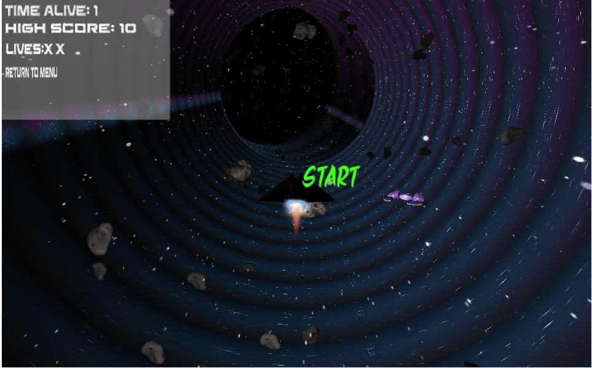

# 'Space Run' - Unity 3D 

## Project Overview

Space Run or 'Space Shooter 2000' was created in 2019 as another 'Endless Runner' type of game popular during this time. The basis for this game is a player placed in a space ship object flying around in a randomly generated tunnel. The player must avoid flying asteriods, the tunnel walls, and continue forward. The players speed increases as the game continues, making the manuevers increasly difficult. The player can pick up 'Power Up' objects that can aid in the players sucess. Player's score is determined by the time spent alive and objects destroyed. 

## Technicals 

### Tech Stack

**Unity 3D  v2019.4** 

     

### Pathing
From a high-level perspective, the pathing algorithm in the game dynamically generates a continuous path for the player or objects to follow, ensuring an engaging and varied gaming experience. The pathing algorithm uses the `ArcFeature` class to generate curved path segments, with parameters like windiness and gradualness dictating the curvature and radius of the arcs. These parameters are adjusted based on the game's difficulty level, affecting the arc's angle and size. The `PathManager` class manages the overall path by maintaining a queue of waypoints, adding new points from the current path feature, and removing points that the player has passed. It continuously updates the path in real-time, using the player's position to determine when to add new segments and remove old ones, ensuring a smooth and continuous path progression.

### Game Controller
The `GameController` script utilizes coroutines for timed events (like wave spawning and color change after scoring), and it manipulates the game's time scale to increase difficulty as the player survives longer. It manages player health, including the effects of losing and gaining health, and updates the UI to reflect changes in score and health. The script also interacts with other components like `PathManager`, `PickUpController` to tie the player to the objects it might encounter. 

## How to Play

Visit: [www.landenfogle.com](www.landenfogle.com)

Gameplay Instructions:
- Simple WASD movement
- Two Lives
- PowerUps (Color, Buckshot, Force Field, Extra Life)

Objective: 
- Time Alive + Objects Destroyed = Score

'R' Key restarts after death

Leaderboard displays high scores!

## Acknowledgements - Credits

November 2019
- [@Landen Fogle](https://www.github.com/landenf)
- [@Lucas Niewohner](https://github.com/Hermanoid)
- [@Samuel Ingledue](https://www.github.com/saingledue)

